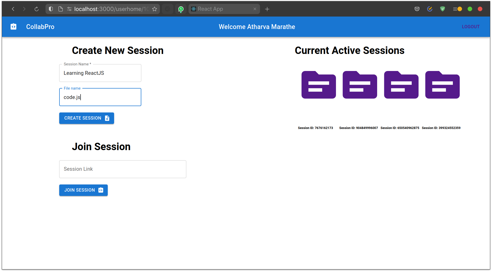
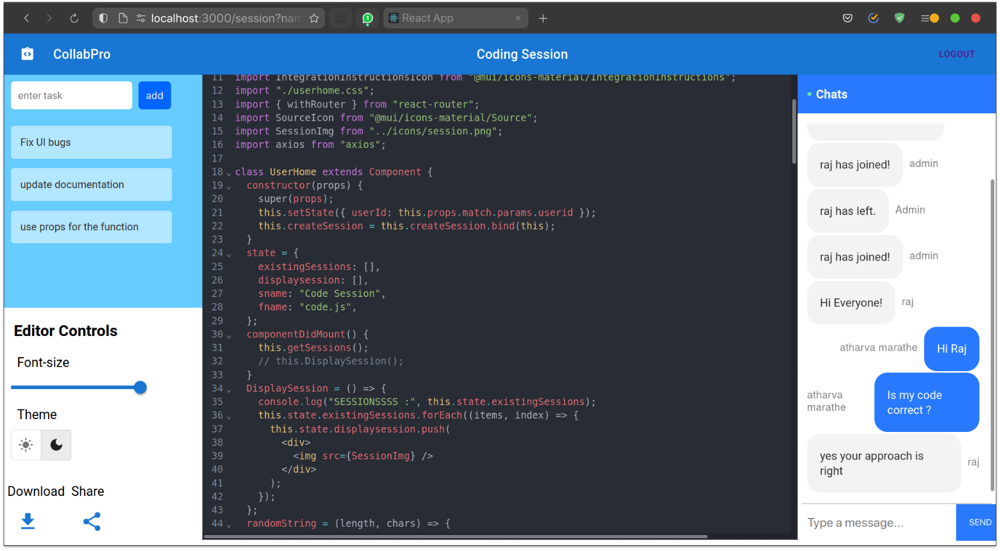

# CollabPro

Building software projects by students, companies working remotely is common
these days. Hence collaborative tools for coding are essential while working on
group or team-based projects. Lot of Collaborative editing tools are available on the
internet, but most of them are Rich Text based editors. CollabPro provides
collaborative experience for coders with syntax highlighting, auto-suggestions
features. CollabPro makes it easy and convenient for teams working on a common
project.

## Features
- OAuth based login authentication / authorization to the application
- Collaborative code editor based on operational transformation library
- Chat-section for users to communicate with each other.
- Shareable link for inviting users to the Collaborative session.
- Syntax highlighting for various languages.

## Screenshots

## Future Scope
- Large projects consist of complex directory structure. So editor supporting this can improve the useability of it
- CollabPro provides chat section to communicate within the users. With the facility of video calling, the collaborative experience will become more useful.
- Support for online compiler and a terminal will ease the developers’ jobs for testing and running the code.
- Adding Version Control System like git will further simplify the job of the developers to commit, fork to their repositories.

## Author

- [Atharva Marathe](https://github.com/atharvamarathe)
- [Avishkar Andhale](https://github.com/avishkar001)